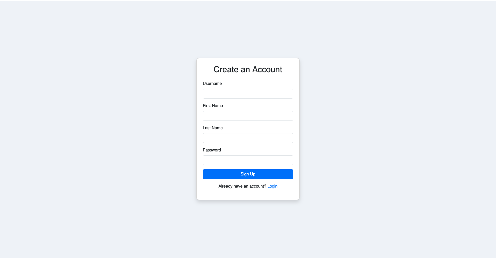
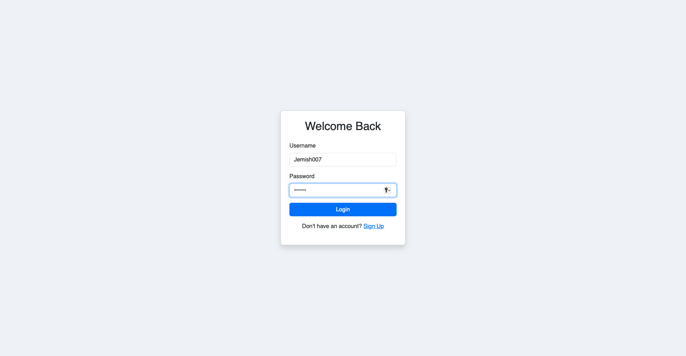
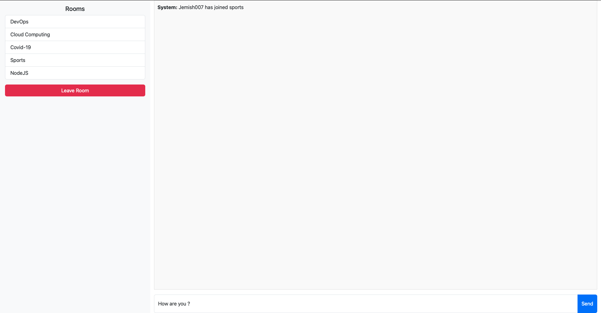
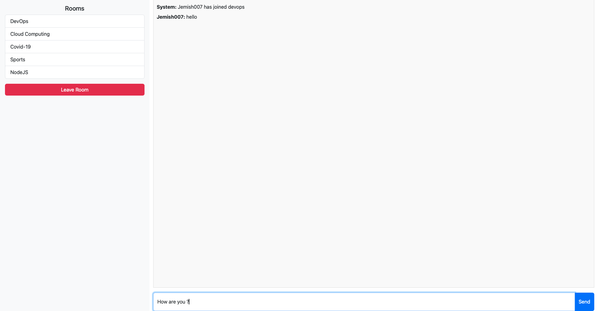
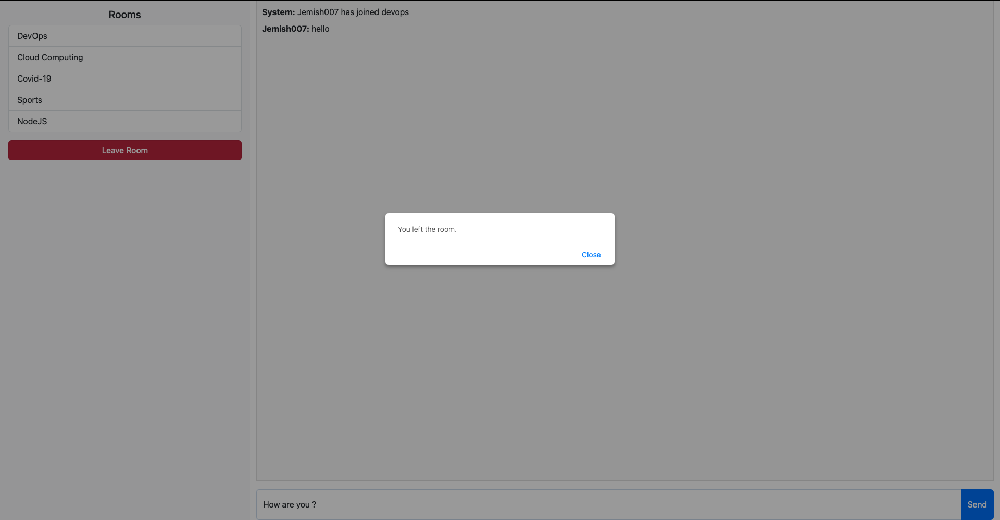
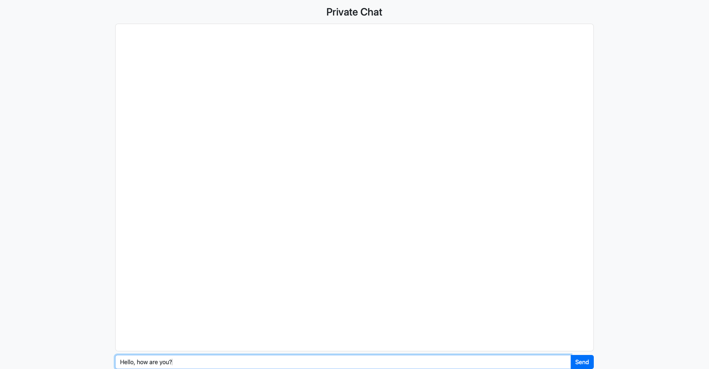

# Chat App

A simple chat application that includes user authentication with a login functionality and a group chat interface. 

## Features

- **User Login:** Authenticate users using a JWT-based login endpoint.
- **Group Chat:** Redirect authenticated users to a group chat interface.
- **Secure Authentication:** Password validation and JWT token generation.
- **Cross-Origin Requests:** CORS is enabled to allow communication between the frontend and backend.

## Technologies Used

- **Backend:**
  - Node.js
  - Express.js
  - [JWT](https://www.npmjs.com/package/jsonwebtoken) for authentication
  - [cors](https://www.npmjs.com/package/cors) middleware to enable CORS
  - (Optional) MongoDB with Mongoose for storing user data
- **Frontend:**
  - HTML/CSS
  - JavaScript (Fetch API)
  - [Bootstrap](https://getbootstrap.com/) for styling

## signup page:

## login page:

## group-chat page:

## group-chat page:

## group-chat page:

## private-chat page:

